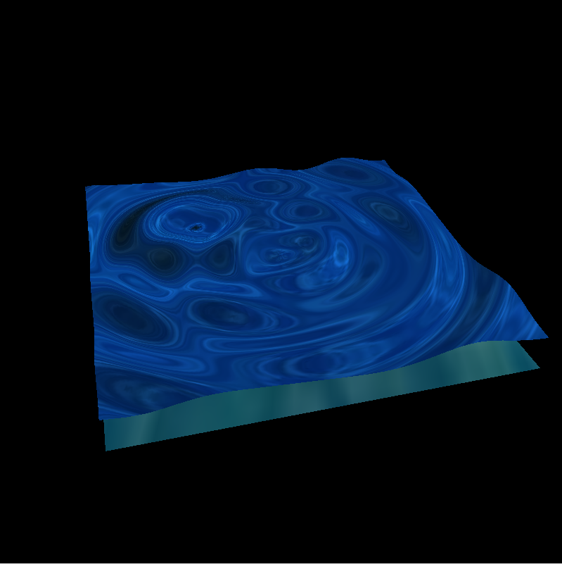
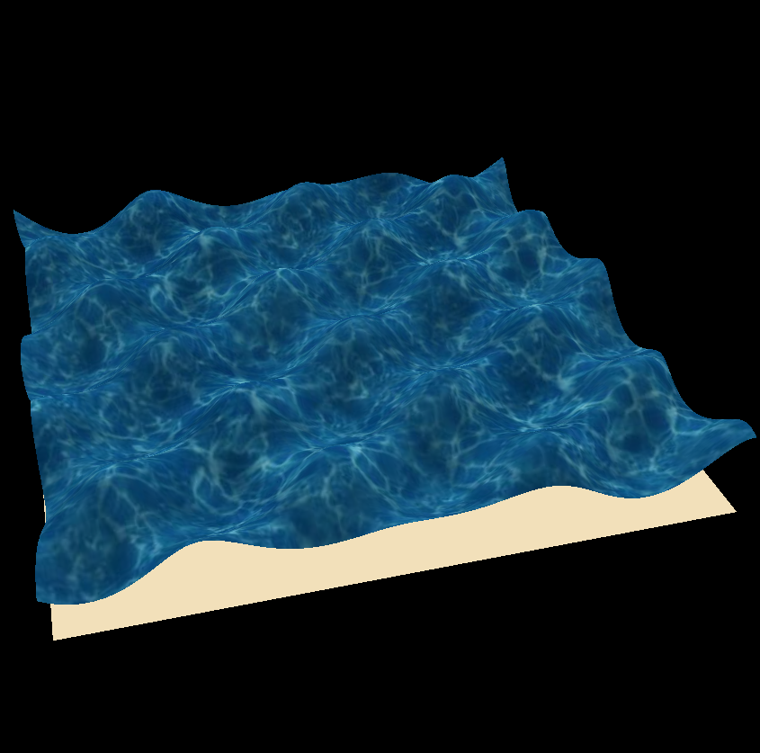

# ToySurface

A toy water surface simulation use naive sin wave and Gerstner wave.

naive sin wave:

Gerstner Wave (ugly texture mapping make it like rag...):

## Usage

- `Left Mouse` to change viewpoint.
- `Right Mouse` to change scale.

## Dependencies

- gcc (C++20 required)
- glut
- glm